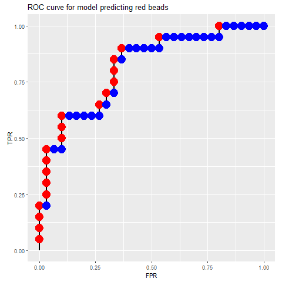
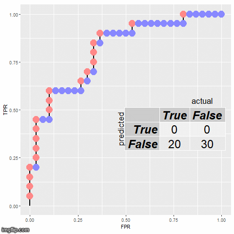
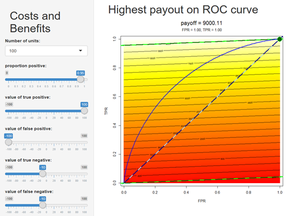

# Decisions, decisions.

_In which we use economic utility models to set a threshold for a binary classifier, based on the cost or benefit of making 4 types of correct and incorrect decisions._

## Web resources

 * [ML Utility Shiny app](https://ml4managers.shinyapps.io/ML_utility/)

## Background

Most machine learning classifiers give fuzzy results; rather than telling you whether a customer will buy a product, they give you estimated probabilities. People accustomed to black and white answers may need to learn new approaches to deal with these shades of gray.

In this series of hands-on exercises, we examine the process of characterizing the performance of a classifier by relating its _sensitivity_ (the ability to detect the positive cases) to its _specificity_ (the ability to not detect the negatives). In general, ML classifiers allow you to make a trade-off between quality and quantity by adjusting a threshold; you have to settle for finding fewer positives if you insist on only taking the purest subset. The theme of this section is to study what that tradeoff means, how to associate it with a cost or value, and how to estimate how much additional value can be realized by using a ML classifier.

In a business context we can often assign dollar values to each of the two types of mistakes a binary classifier can make (it can think a bad widget is good, or it can think a good widget is bad), and to the two ways it can get things right (it can correctly identify a good widget, or correctly identify a bad one). In medical testing there is usually a different weighting for screening tests (where it is important to not miss anybody, so sensitivity is emphasized over specificity), as opposed to confirmatory tests (where you want to be sure the patient really has the disease). Since machine learning makes it possible to test for huge numbers of possible errors (for example, in electronic health record systems), we need to consider the risk of overwhelming users with false alarms (leading to "alert fatigue").

The tradeoffs between sensitivity and specificity need to be evaluated in the context of the system in which the classifier is deployed. Our main exercise in this section is to use an economic utility model to weight these types of errors and help us decide on the best classifier threshold to use to maximize reward in various scenarios. As part of that process we will take an in-depth look at ROC curves, one of the most important types of diagnostic plots for visualizing classifier performance, and frame machine learning as a way to automate (some) decisions (or parts thereof).

## ROC curves and confusion matrixes

Let's say we have a machine learning model that tries to distinguish red beads from blue beads. To make the problem interesting, we can't allow the model to just look at the color; if it could do that, classification would be easy and perfect and we wouldn't need to worry about how to handle uncertainty (and we probably wouldn't need to use machine learning). So we're assuming right off the bat that the model will be predicting the color of the bead from some other characteristics that correlate somewhat, but not perfectly, with color; these might include things about the beads that we could measure (other than the color itself), like density, smoothness, sphericity, diameter, and so forth. In machine learning terms, the color is the _label_, and the various attributes of the bead that we are measuring to use as inputs to the classifer are _features_. The model uses the features to generate a _score_, which is a numeric value that is high if the bead seems likely to be red, and low if it seems likely not to be red (since there are only 2 colors, this means it is likely to be blue). The score is often expressed as the estimated probability of the bead being red, but for our purposes, we don't need it to be calibrated as a probability; we just need the beads that are more likely to be red to have higher scores.

An ROC curve is a plot that shows how well the scores from the model did at separating the beads overall. To draw this curve, we first sort all the beads based on their scores. Since we are (convieniently) dealing with beads, let's imagine putting them on a necklace in sorted order, with the high-scoring beads at the beginning and the low-scoring beads at the end. If the classifier did a good job, there should be more red beads at the beginning, and more blue beads at the end. In the middle of the necklace we expect to find a mixture of red and blue beads.

Now we plot the curve by giving the sorted necklace to a graphic turtle. This turtle is specialized in that it can only make two moves; when it sees a red bead it takes a step in the y-direction, and when it sees a blue bead it takes a step in the x-direction. These steps are scaled based on how many red and blue beads there are, so that by the time the turtle has passed all the red beads it will be at the top of the plot area (1.0 on the y-axis), and when it has passed all the blue beads it will be at the right-hand side of the plot area (1.0 on the x-axis). In other words, the x-axis represents the fraction of all the (negative) blue beads and the y-axis represents the fraction of all the (positive) red beads the turtle has passed in its march from the beginning of the necklace to the end.

> ROC curve for red and blue beads sorted by score from a model predicting whether a bead is likely to be red. The shape of the curve illustrates how well our model was able to tell the red beads from the blue ones. Starting from (0,0), the curve takes a step upward for each red bead, and to the right for each blue bead. There are 20 red beads and 30 blue beads, so the steps in the y-direction are slightly larger than those in the x-direction. By the time we get through all the red beads we are at the top of the plot, and by the time we get through all the blue ones we are at the far right.

If the classifier had done a perfect job, all the red beads would have been at the beginning and all the blue ones at the end, and the curve would have gone straight up from (0,0) to (1,0) as the turtle marched along finding only red beads, until it passed them all, then it would have marched straight to the left as it covered the sequence of only blue beads. The curve would have been square, and the area under the curve would have been the entire unit square, or 1.0. If the classifier had just given random scores to the beads they would have been sorted in random order, and the curve would have been a random walk more or less up the diagonal, and we would expect the area under it to be around 0.5.

The simple turtle-graphics view of ROC curves leaves out one minor detail; if you have tied scores, you should take a diagonal step that covers all the beads in the group of tied scores. This diagonal segment should cover a distance on the x-axis representing the fraction of all the blue beads that are in the tied group, and a distance on the y-axis representing the fraction of all the red beads in the group. The extreme case of tied scores is when the model thinks all the beads are the same, and gives them all the exact same score. This means they are all tied, and should be represented by a straight diagonal line from (0,0) to (1,1). This is a subtle difference from random scores, which would only approximate the diagonal. In the exercises we will see an ROC curve from a simple decision tree model that puts all cases into a small number of score buckets, where all the cases in each bucket get the same score; that curve will show obvious diagonal segments, one for each score bucket.

Choosing a position along the necklace is equivalent to setting a threshold value for the classifier score by which the beads were sorted. All the beads that come before our selected position are above the threshold, and will be predicted to be negative, while all the beads that come after our position are below the threshold, and will be predicted to be positive. Now you should see the quality vs. quantity tradeoff we need to make; we can find more red beads if we are willing to have some blue ones mixed in, but if we want a purer set of red beads, we have to settle for fewer of them. Our challenge will be to figure out the most valuable balance between quality and quantity.

Let's go back to the ROC plot and count how many of the red and blue beads we got right and wrong for each bead position:

> This animation shows the sorted beads (already laid out as an ROC curve by the turtle) being scanned to compute a confusion matrix for each bead position along the sorted necklace. Beads above the threshold are shown in bright colors, while those below the threshold are more pale. Every time the threshold passes a red bead we turn a false negative into a true positive, and every time it passes a blue bead it turns a true negative into a false positive. The test set represented by this curve contains 20 red beads and 30 blue ones.

These little 2 by 2 tables are called confusion matrixes, and they are so important that each cell has a name. Two cells represent cases that are actually positive (red beads); the positive cases that are correctly identified are true positives (TP), and the ones that are incorrectly classified as negative are false negatives (FN). The other two cells show the cases that are actually negative (blue beads); if we got them right they are true negatives (TN), and if we got them wrong they are false positives (FP). They are laid out like this:

predicted \\ actual | True | False |
--------------------|------|-------|
               True |  TP  |  FP   | 
              False |  FN  |  TN   | 

## Linear utility model

We saw above that any point on the ROC curve can be represented by a 2 by 2 confusion matrix. But actually, we could make one of these little confusion matrixes for any point on the whole TPR vs FPR plane; the curve just shows which of those points (and which of those confusion matrixes) are reachable by a given model. As long as we know how many cases in the test set are actually positive and how many are actually negative, then for any combination of true positive rate and false positive rate (that is, for any point on the plane), we can figure out the four entries in the 2 by 2 confusion matrix:

	* `TP = TPR * N * P`
	* `FP = FPR * N * (1-P)`
	* `TN = (1 - FPR) * N * (1-P)`
	* `FN = (1 - TPR) * N * P`

Here N is the total number of cases, and P is the proportion of those cases that are positive (this proportion is also called the "prevalence" of positive cases). So the overall number of positive cases is `N * P` and the number of negative cases is `(1 - P) * N`. 

We will be studying the interaction between two concepts that we can represent together in "ROC space". One is the ROC curve itself, which plots all the options the classifier gives you for trading off quality (low rate of false positives) against quantity (high rate of true positives). The second concept involves assigning values to the possible values of TPR and FPR, based on how much we think we would gain from each true positive case, how much we lose from each false positive, etc. Once we have made estimates for a set of value parameters and the overall prevalence of positive cases, we can calculate a value for each point on the plane on which the ROC curve is plotted, and represent these payoff values by coloring the background.

> Shiny app showing economic utility in ROC space. The settings on the left are used to compute the “payoff” value of every point on the plane of true positive rate (TPR) vs. false positive rate (FPR); this is used to color the background. The parallel black lines are “lines of indifference”, showing contours on the cost surface (since this cost model is linear, these are parallel lines). The diagonal is emphasized by a dashed line; this is basically the performance of a "null" model that cannot tell the beads apart at all. Two special lines of indifference are also shown with bedazzled dashed lines; the one that passes through the origin, and the one that passes through (1,1). The line of indifference passing through the origin connect the points that have the same payoff value as when nothing passes the threshold, and the one passing through (1,1) has the same payoff as when everything passes the threshold. An ROC curve showing the performance of a particular model on a particular test set is shown in blue, and the green spot shows the point on the curve with the highest payoff. In this case the highest payoff is at (1,1), representing a threshold where all cases are considered positive, and the classifier is not useful.

# Example Scenarios

The first two tasks in the 'Exercises' section below will be to get you familiar with how the sliders in the Shiny App affect the value model, but this all leads up to Exercise 3 where you are asked to invent some fictitious business scenarios to go with particular value settings. To get you thinking about these kinds of scenarios up front, we'll first present a couple of examples.

## Screener scenario

A very common use case for ML classifiers it to pre-screen cases to handle the obvious things before bumping the more difficult ones up for a human to handle. This is like a bot that uses an FAQ to screen calls; it tries to figure out if it is confident enough that the caller's question is one it knows the answer to that it can go ahead and answer it, or if the caller really needs to speak to a human. You can usually think of this situation as a set of one-vs-all binary classifiers; Is it question 1? Is it question 2, etc. Deciding how confident the bot needs to be before it goes ahead and sends the approved answer to the question it thinks the caller is asking requires setting a threshold. If you can frame the problem in terms of how valuable it is to use the bot compared to the old system of just having humans answer all the questions, you only need to set three sliders:

  * Slider 1. How common is this question? (P) What proportion of all questions are this one?
  * Slider 2. How much benefit do I get if the bot correctly answers this question? (TP) In other words, how much do you save by not having to engage a human employee?
  * Slider 3. What is the cost of sending the answer if it turns out to NOT be what the customer was asking? (FP) This cost might be a matter of annoying the customer, but you have to estimate it in the same value units as the other value questions.

In this scenario, you can leave the last two slider values set to zero, because if the bot classifies the question as negative (not something it wants to answer), it will get bumped to the human (whether it is a True Negative or a False Negative), and the cost of that is no different than the old system, because a human still has to answer the question.

## Widget scenario: setting all 4 values

You are running a factory that makes widgets, and the classifier examines them as they come off of the assembly line to judge whether the widget is good or not. A 'bad' widget is one that is likely to fail and be returned by the (probably unhappy) customer. Let's frame this problem as a good widget detector (we could do an exactly equivalent analysis by thinking of it as a bad widget detector, but we have to pick one way to label positives and negatives, and stick to it). So this is what the sliders represent:

  * Slider 1: What proportion of all the widgets coming off of the assembly line are good? (P)
  * Slider 2: How much is a widget worth if we correctly identify it as good? (TP)
  * Slider 3: How much does it cost us when we sell a bad widget? (FP)
  * Slider 4: How much does it cost us to make a widget, then figure out it is bad and not sell it? (TN)
  * Slider 5: How much does it cost to mistakenly assume a widget is bad, and not sell it? (FN)

If almost all of the widgets your factory produces are good, you make a lot of money by selling each one, and the cost of selling a bad one is low, then it might not be useful for you to invest in an ML classifer. But if you only make a little money per widget, there are a lot of bad ones produced, and it is a big disaster for the customer when a widget fails, then the additional quality control from an ML classifier could make the difference between your business being viable or not.

Once again, slider 3 is probably the most difficult one to assign a value to. You need to consider possible lawsuits, damage to your reputation, and so forth, and boil all those things down into a number that can be compared to the other values. But we need a number here so we can think about the tradeoffs. In many cases a ballpark estimate is enough to shed some light on the questions. Besides, if your job were easy anybody could do it.

For practical purposes, the values of the TNs and the FNs are probably the same, because in both cases you make a widget and decide not to sell it. This would be the cost of producing it (probably a negative value) plus the cost of recycling it (it might be worth something as parts or as scrap, so this value might actually be positive). It is a bit of a stretch to imagine a scenario where the TN and FN values are different; the best I've come up with so far might be if a recycler would pay more for your rejects if they include more good widgets.

# Exercises

Open a tab to the [ML Utility Shiny app](https://ml4managers.shinyapps.io/ML_utility/) to work through these problems. 

## Exercise 1: The effects of prevalence, or the proportion of positive cases.

The contours on the value surface are called "lines of indifference" because all points along those lines have the same total value. Since this is a linear model, these lines are all straight and parallel to one another, and any line with the same slope connects points that all have the same overall value.

Set the proportion of positive cases to 0.5; this means that there are the same number of positive and negative cases in the test set, so the x and y axes (TPR and FPR) are on the same scale. In other words, 0.1 TPR represents the same number of true cases as 0.1 FPR represents false cases.

Set the value of a true positive to 100 and the value of a false positive to -100. Leave the values of true negatives and false negatives both set to zero.

Note that the contour lines on the value surface are at a 45 degree angle. This is because every false positive loses as much value as every positive case gains; so when you move along a lower left to upper right diagonal lines the gains and losses balance out exactly.

Now move the top slider to change the proportion of positive cases to 0.8; this makes it so that there are exactly 4 times as many positive cases as negative cases. This means that a given distance on the y-axis (TPR) represents 4 times as many cases as the same distance on the x-axis (FPR). Now our lines of indifference have a slope of 1:4 because the true positives and false positives still have exactly opposite values (they balance each other one to one), but to get the same number of false positive and true positive cases you now have to move 4 times as far on the FPR axis as you do on the TPR axis.

Once the costs are fixed, the slope of the indifference lines is determined by the ratio of true to false cases. The higher you set the proportion of positive cases, the more shallow the slope of the contour lines becomes. If you set it to a very low value, the lines have a very steep slope. 

## Exercise 2: Crossing the threshold.

Let's go back to that turtle marching along the beads of a string. Each bead is really either red or black, but as the turtle pushes the cutoff threshold past a bead, he is considering it to be red. If it is actually red and he has marched past it, it is a true positive, but if he has not reached it yet it is a false negative. So when the threshold moves past a red bead, it converts a FN to a TP; it is a zero-sum situation among the red beads. Likewise, when the threshold moves past a black bead, a TN gets changed to a FP. So really only two values matter for finding the optimal threshold: the difference in value between a TP and a FN, and the difference in value between a TN and a FP. In this exercise, we'll show that the Shiny app always picks the same threshold value based on these differences.

Note that even though the _position_ of the optimal threshold is determined by these two differences in value ( `TN_value - FP_value` and `TP_value - FN_value` ), the value of the total payoff does depend on all 4 values. 

## Exercise 3: Utility scenarios.

Now that you have a feel for what the sliders do, it is time to get creative:

1. Using the ROC curve for the random forest model, find a set of slider settings where the optimal threshold puts the blue dot all the way in the upper right corner. Make up a fictitious business scenario to go along with these slider settings. If your optimal threshold is so low that all cases are accepted (TPR and FPR are both 1.0), is the classifier useful?

2. Find slider settings where the `rule` model had a higher payoff than the `decisionTree` model. Can you make up a business scenario to go along with these settings? What is the payoff of the `randomForest` model under these value conditions? Can you think of any circumstances where the `rule` model might be preferable to the `randomForest` model?

3. Find slider settings where the `randomForest` classifier is useful (that is, it provides a better payoff than no model at all), but the other models are useless. Invent a business scenario to go with these settings.

4. Can you find slider settings where no classifier could possibly be useful? Can you make up a scenario to go with these settings?

# Notes: 

## ROC vs Precision-Recall
Sometimes it is easier to think about the quality-quantity tradeoffs in terms of Precision and Recall, instead of TPR and FPR (or Sensitivity and Specificity). So we've added an option to display the classifier performance and utility model on a Precision-Recall curve instead of an ROC curve. We won't do any exercises with the PR curve, but you might find it interesting to compare these two popular types of performance curves, and I'd like to point out a few details. First, the PR curve itself changes when you change the prevalence slider. ROC curves are special in that they completely separate the positives on the y-axis from the negatives on the x-axis, so they are invariant to prevalence. Not so with PR curves. Also, our linear utility models are are not linear in PR space; the nice parallel lines of indifference we saw in ROC space are curved in this representation. And the cost surface goes to such large negative values toward the bottom right that I had to put a limit below which it is just colored red (otherwise the deep chasm soaks up all the dynamic range for the color scale). But the same general ideas of making a quality vs. quantity tradeoff apply, and both views should arrive at the same optimal threshold and the same payoff.

## Real ROC curves have statistical variation
A single ROC curve really just represents the performance of the classifier on a particular test set, and if we had used a different randomly chosen test set the curve would have been slightly different. It is pretty common to assume that the test set is representative of the data you would really like to use your model on, but it would be appropriate to mark the sampling variability with error bars or error bounds. We haven't done that here because the visualization is already very busy, but keep in mind that the curve is estimated from a sample and there is some error associated with it.

## Confusion matrixes are confusing
I know a little 2 by 2 confusion matrix seems like it should be really simple, but it can be really, well, _confusing_, for several reasons. The first confusing thing is all the negating (a false negative is actually positive). Then there is all the symmetry: you've got two cells that depend on the TPR and two that depend on the FPR; two that depend on the prevalence and two that depend on one minus the prevalence, and two that depend directly on the rate (be it FPR or TPR), and two that depend on one minus those rates. That's a lot of symmetry to squash into just four cells. And if that's not bad enough, you could always flip the definition of what you consider positive and perform an exactly equivalent analysis on the mirror image problem; say you are trying to build a classifier to detect counterfeit $20 bills: you could define a bogus bill to be positive and a real bill to be negative (that is, not counterfeit), or you could describe an exactly equivalent classifier as a good bill detector, in which case a counterfeit bill is negative. You've got to pick one definition of 'positive' and stick to it. But probably the most confusing thing is many of the metrics derived from the confusion matrix have a lot of different names for the same thing; for example, "False Positive Rate", "Sensitivity" and "Recall" all mean exactly the same thing: they are the ratio of true positives to all positives (`TPR = TP/(TP + FN)`). Look at the diagram at the bottom of the Wikipedia article on [confusion matrix](https://en.wikipedia.org/wiki/Confusion_matrix) and see if that isn't confusing. But the reason that so many of these concepts have multiple names is that they are so important that they were independently discovered by people in different fields. The bottom line is that these are important concepts, and it is worth spending some time thinking about them.

